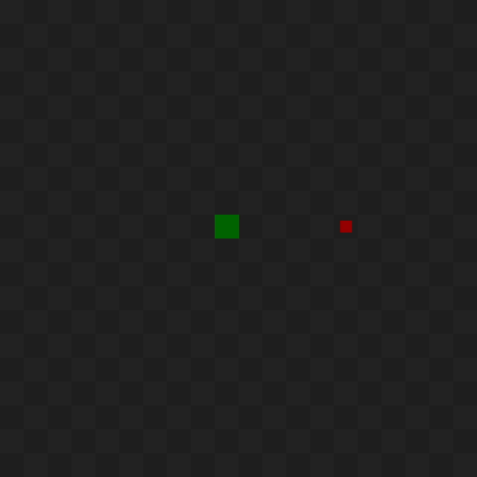
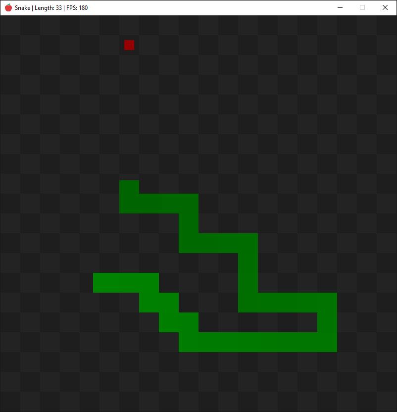

# Snake (OpenGL)
### - [How to build project?](#how-to-build-project)

 

 

# How to build project
### To build project you need CMake. You can install Cmake [here](https://cmake.org/download/). 
### Then you need to clone repo on your computer and in the local repo enter these comands to console: - `cmake -B build -S .` to generate build files - `cmake --build build` to build project Also you can generate build files and build project with CMake GUI.
### Repo contains `CmakePresets.json`. You can enter: - `cmake --preset <preset_name>` to generate build files - `cmake --build --preset <preset_name>` to build it To use these commands you must have generator and compiler listed in preset on your computer.